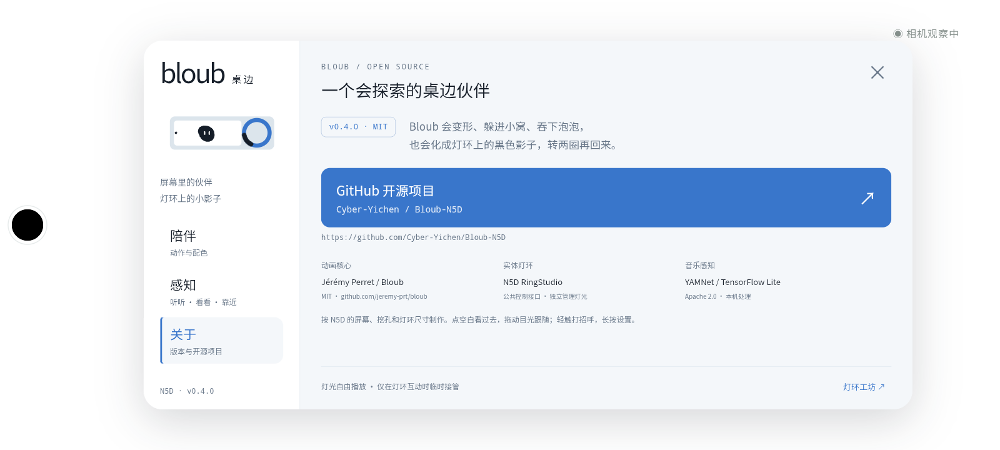

# N5D 桌边 · 0.4 设计记录

## 方向

一个在办公桌上有自己的生活、会与洞口和实体灯环玩耍的柔软小伙伴。画面使用大片留白、一个主体、少量与动作有关的粒子；正常播放没有仪表盘或常驻文字。白底黑 Bot 为默认，保留四套配色和渐变轮换。新增功能在长按设置中打开。

## 一张整机坐标图

测量来源：用户提供的屏幕与整机测量，公开几何整理见 [device-geometry.md](docs/device-geometry.md)，灯位来源为 [RingStudio light-layout](https://github.com/Cyber-Yichen/N5D-RingStudio/blob/main/docs/light-layout.md)。

| 对象 | 统一坐标/尺寸 |
| --- | --- |
| 显示区域 | 1600 × 720 |
| 物理挖孔 | 中心 (44,360)，R24 |
| 显示圆角 | R60 |
| 灯环中心 | (2150,360)，在屏幕右侧之外 |
| 光带中线半径 | 32.8 mm / 0.0942 = 348.2 px |
| 发光区域与屏幕右边缘间距 | 约 16.7 mm；中线间距约 19.0 mm |
| 彩灯/白灯 | 24/24；顶部起顺时针，白灯再偏 7.5° |

screen / ring 由同一纯函数采样：Bot 经过屏幕右缘、跨过无显示间隔、在 C18 接入圆周；它成为同时关闭 RGB 和白灯的黑色缺口，绕两圈后飞回屏幕。RGB 数组用空间顺序，服务负责 BGR 接线映射。没有再把左侧挖孔等同于右侧灯环入口。

几何是正面照片估计，用于视觉连续性；没有重新声称是 PCB 精密坐标。固定物理遮挡保持 R25；洞口“变大”是外围图形延伸，真实孔本身不变。

## 六分钟故事

| 时间 | 动作 |
| --- | --- |
| 0–25s | 陪伴、眨眼、随机形状 |
| 25–84s | 看小窝、洞口长出眼睛、双方贴近、收成蛋形、藏入、探头、再次藏入、返回 |
| 84–115s | 洞口吐黑色泡泡，泡泡沿弧线被吸收；Bot 逐渐长大约 32%，再缓慢恢复 |
| 115–140s | 三角练习、随机形变和休息 |
| 140–188s | 发现右侧、缩小为小影子、出屏、跨间隔、实体灯环绕两圈、返回长大 |
| 188–205s | 眨眼庆祝、粒子散开再重组 |
| 205–252s | 送出圆形光波、按物理距离扫过灯环、灯环返回一圈光、接收后休息 |
| 256–277s | 弧线跳跃、彗星、转圈、轻微拉伸与挤压 |
| 277–346s | 安静观察、移到右侧打盹、醒来伸展、返回 |
| 346–360s | 回到循环起点的陪伴姿态 |

八种上游形状：圆、卵石、圆角方形、胶囊、三角、六角、云、水滴。以带种子的洗牌安排随机段，一袋包含所有形状；随机只决定目标形状，引擎负责插值。探洞、灯环交接、吸收泡泡期间固定圆形，保证几何与遮挡可靠。不同循环有不同组合。

每次剧情变形保留完整最短时长，burst/comet/orbit 不会在散开或未重组时被剪断。普通位置轨迹使用五次 minimum-jerk，休息点速度和加速度归零；飞入 / 圆周 / 飞出使用五次 Hermite，交接点匹配切线速度与向心加速度，圆周 20 秒匀速转两圈；返回起点的数值姿态连续。表情、轮廓、眼睛继续使用上游引擎的过渡。

## 实体灯环的占用

第 149–187s、219–240s 临时申请；约 10 fps 完整帧刷新，10s 可续租租约。开始和归还前分别渐变 2.5–3s、2–3s。结束 RELEASE 恢复工坊原效果、Logo 和设置。闲置、探洞、泡泡、打盹和安静模式不占用。切后台、关闭灯光、帧中断 1.8s 释放。

故事和 LED 不各自维护动画时钟。统一采样器产生 72 RGB 字节、24 白灯字节和混合比例；原生端只校验范围、管理会话和混合采样前的实际灯光。RGB 有效字节最高 68，白灯最高 22，避免叠乘亮度。白灯用独立半格坐标计算，未当作同位 RGB 合成白。

服务恢复的是自己运行的灯效相位；交还最后一帧与工坊此刻相位不一定完全相同。接口不可用时，Bot 的出屏动作柔和转为屏幕右侧的小范围散步，继续保持可见。

## 感知与实际能力

| 感知 | 本版实现 | 边界 |
| --- | --- | --- |
| 麦克风 | 官方 YAMNet 4,126,810 字节模型；16kHz、0.975s 窗口，约每 1.1s 分类；音乐置信度驱动摇摆和音符，语音驱动倾听表情 | 无歌词、录音保存或云传输；音乐反应在普通陪伴段叠加，正在进行的洞口/灯环故事先保持连贯 |
| 摄像头 | ID “2”，480×640；每两分钟约 5s；240×320 内存图像、帧差动作检测、系统轻量人脸检测和目光方向 | 不识别人名/身份，不用表情推断内心情绪；实际出帧已测，脸部检测仍取决于距离、光照和角度 |
| ToF | 固定节点，只接受 status=0；无效或超时设 distance=-1；普通权限失败时使用固定只读 Magisk helper | 不改节点权限、不关闭 SELinux、不写校准/初始化；必须有该 APK 的实际 Root 授权；无有效样本不触发靠近 |
| APU | 尝试指定 apunn 的 NNAPI，先运行零输入自测；失败回退 CPU | 实机日志仅 2/47 算子被 NNAPI 接收，39/47 使用 CPU XNNPACK，不是整模型 NPU 加速 |

摄像头和音频默认通过长按设置明确开启，状态可随时查看和关闭。感知任务只在前台运行；后台停止相机、麦克风及 ToF helper。音频和图像只存在内存，APK 没有网络权限。音符不是录音内容展示。

## 调研与复用

- [jeremy-prt/bloub](https://github.com/jeremy-prt/bloub)：本工程实际复用的 MIT 核心，14 种动作、轮廓插值、表情、8 种自定义形状。设备故事与感知由此项目新增。
- [iduu/grokbot-animation](https://github.com/iduu/grokbot-animation)：参考完整动作生命周期、共享时钟和状态/形状分离。其第三方参考素材没有授予开源许可，因此本版没有导入该数据包。
- [nasawz/GrokBot](https://github.com/nasawz/GrokBot)：BSD-3-Clause 的 Flutter 头像实现；参考状态中的表情节奏和随机池做法，没有为此版引入 Flutter 运行时。
- [Eyadkelleh/Grok_bot](https://github.com/Eyadkelleh/Grok_bot)：SVG 工作室与 Bloub 动作对应关系，主要作为展示和动作覆盖的参考。
- [TensorFlow 官方音频分类示例](https://github.com/tensorflow/examples/tree/master/lite/examples/audio_classification/android)：本版 YAMNet 移动模型的下载来源。运行时固定 TensorFlow Lite 2.14.0，附 Apache-2.0 许可，模型、类目表和 AAR 校验记录在 android/dependencies.sha256。
- [MediaTek MT8788](https://i.mediatek.com/in/smart-home-iot)、[Android NNAPI](https://developer.android.com/ndk/guides/neuralnetworks)：芯片 APU 和 Android 加速接口参考。是否真的执行由实机日志判断。

## 视觉检查与验证

已看实际设备画面：洞口小伙伴与主体相接、泡泡靠近主体、长大的六角形、彩色轨道均可见，白底黑 Bot 对比清楚；物理洞口遮挡与实测坐标吻合。新增整机诊断预览将屏幕和所有 LED 画在同一布局，用于检查跨间隔和光波到达顺序。

227 项测试通过；两个完整循环逐帧检查路径有限、形变有限、接缝位置/加速度和亮度范围。设备剧情验证记录在 n5d-reports/story-evidence.json，感知能力与验证边界见 N5D-README。

## 0.3 界面

按 frontend-design skill 重新设计。主色 tokens：墨色 #151d28、说明灰 #667587、浅灰底 #f4f7fa、分隔 #dce5ec、操作蓝 #3976cb、白色 #ffffff。字号 27 / 21 / 17 / 15 / 12；拉丁字标用 Trebuchet MS，中文正文用设备的 Noto Sans CJK SC / Microsoft YaHei，版本及数据用 Consolas / monospace。字体全部来自本机，不加载网络字体。

左侧窄导航展示一幅屏幕 + 挖孔 + 黑色缺口灯环的缩略整机图；右侧是陪伴、感知、关于三页。审视原方案后，去掉通用深色半透明控制卡，改为设备示意承担视觉识别，其余控件保持浅底与清楚的状态。设置在统一 1600 × 720 画布内缩放，留出真实挖孔和圆角。

设置打开时暂停剧情并释放灯环，不让设置图示占用硬件。关于展示版本、GitHub、上游署名及模型来源。可见键盘焦点；系统减少动态时停用装饰转动与页面过渡。已检查实际 WebView 的陪伴页排版；独立 Chrome 预览的陪伴、感知、关于三页均无内容裁切。关于预览见下图。

入环前 Bot 轮廓半径缩至约 70 px / 6.6 mm，匹配黑色缺口的核心尺寸；环上位置和大小由同一几何约束决定。

## 0.4 屏幕交互

点击空白和按住拖动使用短时目光目标。触点换算为整机画布坐标，随 Bot 当前显示位置重新计算；先反解旋转和拉伸，再用上游“正 pitch 朝上”的约定。目光有平滑进入、连续改目标、松手停留和逐渐归还，不把一次性变形剪断。

触摸 Bot 按实际 SVG 轮廓命中，旧 WebView 采用 Path2D 兜底。空白触点淡涟漪只保留最近四次，不随长期运行堆积。减少动态时关闭弹性形变，涟漪仅淡出。交互目光不改变物理轨迹或灯环租约。

公开来源和免责声明分别见 REFERENCES.md、DISCLAIMER.md。

### 0.4 实机验证

N5D 实际触摸确认空白点击转头、拖动连续跟随、轻触身体眨眼并清除旧目标。三页设置内容高度均为 379 px，无裁切。灯环在 156、158.5、161、166、171、175.9 秒采样时，对应位置的 RGB 三通道与白灯均为零；设置打开和互动结束后归还公共 API 会话。截图见 docs/n5d-assets/。
