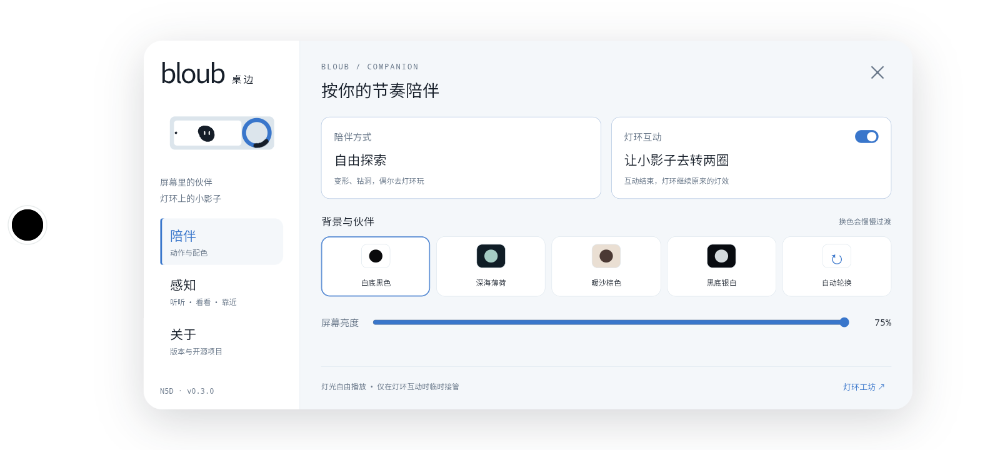
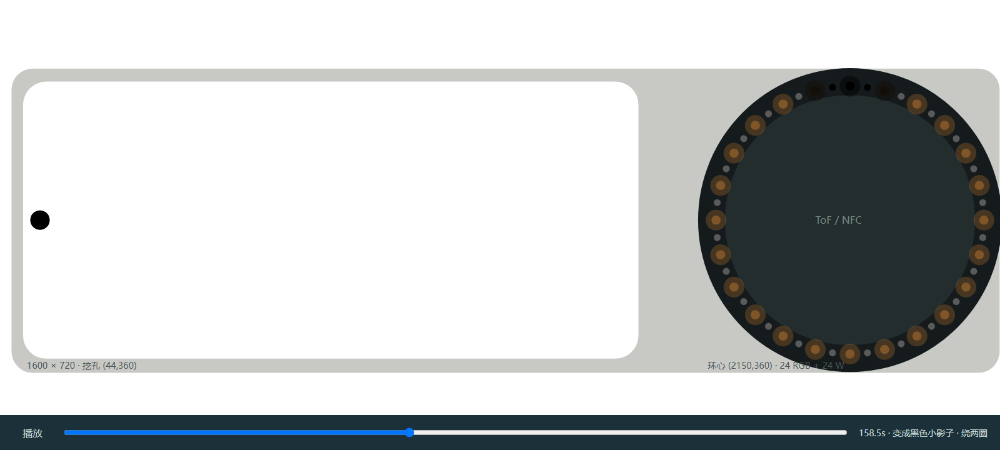

# Bloub 桌边 · N5D

一个在 N5D 上独立运行的桌边小伙伴。基于 [Jérémy Perret 的 Bloub](https://github.com/jeremy-prt/bloub)，按屏幕、挖孔和实体灯环的实测尺寸重新编排动作。

[下载 APK](https://github.com/Cyber-Yichen/Bloub-N5D/releases/latest) · [使用与构建](N5D-README.md) · [动画设计](N5D-DESIGN.md) · [上游说明](docs/UPSTREAM-README.md)



## 它会做什么

- 一轮六分钟，持续循环：随机八种形状、眨眼、钻洞、洞口小伙伴、吞泡泡长大、彗星、光波、打盹。
- 飞向屏幕右侧的实体灯环，化成一段**黑色影子**，匀速转两圈，再沿切线飞回屏幕。影子经过的位置同时熄灭 RGB 和白灯。
- 白底黑色、深海薄荷、暖沙棕色、黑底银白和自动换色；切换时柔和过渡。
- 可选音乐耳朵、短时相机观察、ToF 靠近反应。音频和画面只在本机内存处理，不保存、不上传。
- 长按打开“陪伴 / 感知 / 关于”；关于中可打开本项目 GitHub。



## 灯环协作

需安装 [N5D RingStudio](https://github.com/Cyber-Yichen/N5D-RingStudio)，并在其“关于”启用其他应用控制。仅在互动时申请公共 API 会话；互动结束、打开设置、切后台或关闭灯光后归还，恢复工坊原灯效和设置。没有服务时保持屏幕内的替代动画。

## 快速开始

下载最新 Release 的 APK，安装并打开 **Bloub 桌边**。轻触打招呼；长按 650 ms 或 Android 返回键打开设置。

```bash
pnpm install --frozen-lockfile
pnpm dev:n5d
pnpm test
```

Android 构建步骤见 [N5D-README.md](N5D-README.md)。网页开发预览没有硬件权限，感知和灯光需在 N5D 运行 APK。

## 许可与来源

本项目及上游 Bloub 使用 [MIT](LICENSE)，保留 Jérémy Perret 的版权声明。新增 N5D 适配由 Cyber-Yichen 维护。音频模型及 TensorFlow Lite 使用 Apache 2.0，许可随 APK 一起分发。灯环通过独立项目的公共接口控制。

本项目与 xAI、Grok 无隶属关系。动画核心来源与原始参考说明见上游文档。
